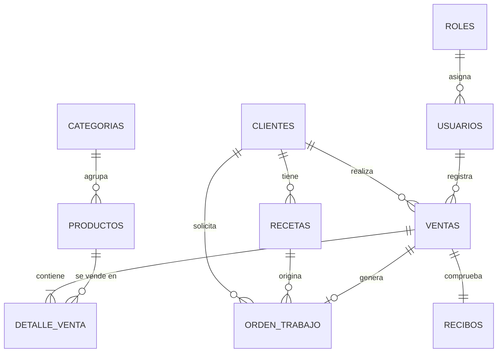
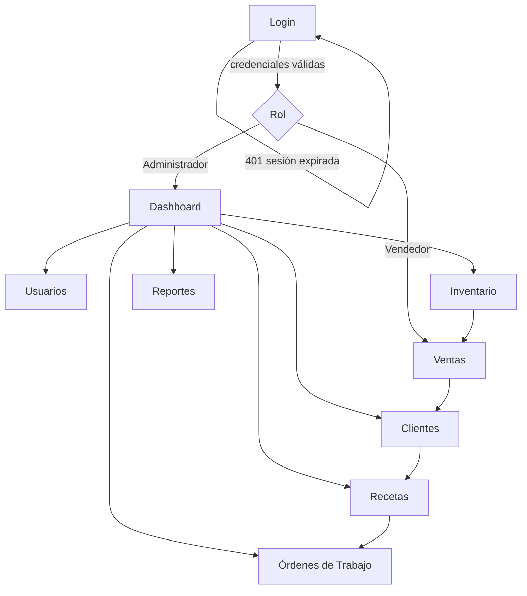
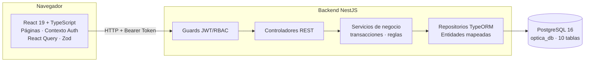
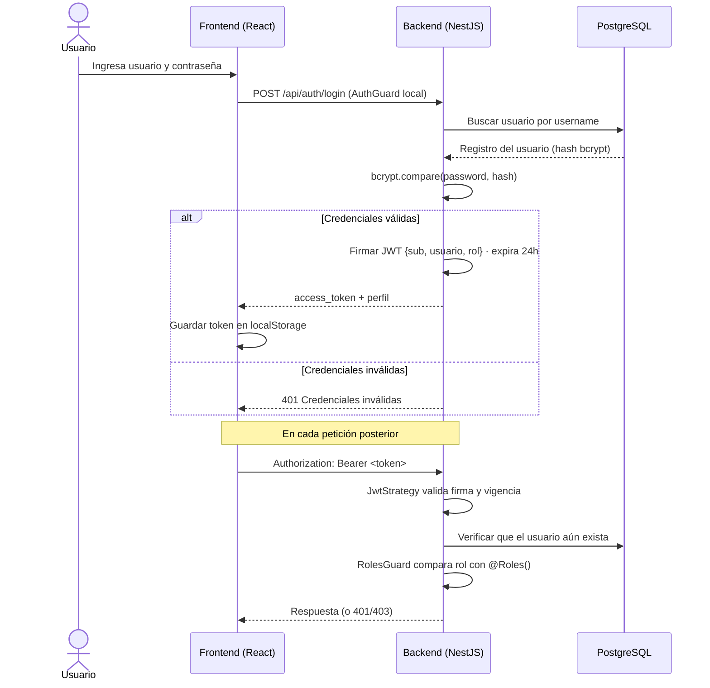
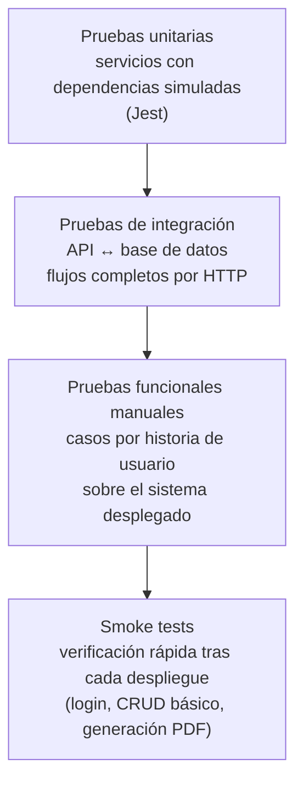

# IV. MODELADO Y DISEÑO DE LA SOLUCIÓN

Este capítulo traduce lo definido en la metodología a decisiones de diseño concretas: cómo se estructuran los datos, cómo se comunica el sistema, cómo luce la interfaz y cómo se protege todo el conjunto.

## 4.1. Modelado de datos

La base de datos `optica_db` se diseñó sobre un modelo relacional normalizado, con diez tablas que cubren las siete épicas del MVP. El esquema completo se define mediante SQL (`database/tablas.sql`), lo que permite crear la base desde cero tanto en instalación local como dentro del contenedor Docker.

### Diagrama Entidad–Relación



El modelo gira alrededor de tres ejes: la persona (**clientes**, con sus **recetas**), la operación comercial (**ventas** con su **detalle** y **recibo**) y la producción (**orden_trabajo**, que une cliente, receta y venta). Los usuarios intervienen como responsables de cada venta, siempre bajo un rol definido.

### Diccionario de datos

Las tablas principales, con tipos y restricciones más relevantes:

**roles**

| Campo | Tipo | Restricción |
|---|---|---|
| id | SERIAL | PRIMARY KEY |
| nombre | VARCHAR(50) | UNIQUE NOT NULL |

**usuarios**

| Campo | Tipo | Restricción |
|---|---|---|
| id | SERIAL | PRIMARY KEY |
| nombre | VARCHAR(100) | NOT NULL · solo letras |
| apellido | VARCHAR(100) | opcional · solo letras |
| ci | VARCHAR(30) | UNIQUE NOT NULL · numérico (3–15 dígitos) |
| usuario | VARCHAR(50) | UNIQUE NOT NULL · alfanumérico con `.` y `_` |
| password | VARCHAR(255) | NOT NULL · hash bcrypt |
| telefono | VARCHAR(30) | opcional · numérico (6–15 dígitos) |
| direccion | VARCHAR(100) | opcional |
| rol_id | INT | FK → roles |

**clientes**

| Campo | Tipo | Restricción |
|---|---|---|
| id | SERIAL | PRIMARY KEY |
| ci | VARCHAR(30) | UNIQUE NOT NULL · numérico (3–15 dígitos) |
| nombre / apellido | VARCHAR(100) | NOT NULL / opcional · solo letras |
| telefono | VARCHAR(30) | opcional · numérico (6–15) |
| sexo | CHAR(1) | CHECK ('M' o 'F') |
| fecha_registro | TIMESTAMP | DEFAULT CURRENT_TIMESTAMP |

**recetas**

| Campo | Tipo | Restricción |
|---|---|---|
| id | SERIAL | PRIMARY KEY |
| cliente_id | INT | FK → clientes |
| fecha | DATE | DEFAULT CURRENT_DATE |
| clinica_externa | VARCHAR(150) | opcional |
| esfera_od / esfera_os | NUMERIC(5,2) | valores ópticos ojo derecho / izquierdo |
| cilindro_od / cilindro_os | NUMERIC(5,2) | ídem |
| eje_od / eje_os | SMALLINT | ídem |
| add_od / add_os | NUMERIC(5,2) | adición para visión cercana |
| dp_od / dp_os | NUMERIC(5,2) | distancia pupilar |
| observaciones | TEXT | opcional |

**categorias** — `id SERIAL PK`, `nombre VARCHAR(80) UNIQUE NOT NULL`.

**productos**

| Campo | Tipo | Restricción |
|---|---|---|
| id | SERIAL | PRIMARY KEY |
| categoria_id | INT | FK → categorias |
| codigo | VARCHAR(50) | UNIQUE NOT NULL |
| nombre | VARCHAR(150) | NOT NULL |
| descripcion | TEXT | opcional |
| marca / color | VARCHAR | opcionales |
| precio_compra / precio_venta | NUMERIC(10,2) | DEFAULT 0 |
| stock | INT | DEFAULT 0 |
| stock_minimo | INT | DEFAULT 0 · dispara alerta en dashboard |

**ventas**

| Campo | Tipo | Restricción |
|---|---|---|
| id | SERIAL | PRIMARY KEY |
| cliente_id | INT | FK → clientes |
| usuario_id | INT | FK → usuarios (vendedor que atendió) |
| fecha | TIMESTAMP | DEFAULT CURRENT_TIMESTAMP |
| subtotal / total | NUMERIC(10,2) | DEFAULT 0 |
| metodo_pago | VARCHAR(30) | CHECK: EFECTIVO, QR, TARJETA o TRANSFERENCIA |

**detalle_venta**

| Campo | Tipo | Restricción |
|---|---|---|
| id | SERIAL | PRIMARY KEY |
| venta_id | INT | FK → ventas ON DELETE CASCADE |
| producto_id | INT | FK → productos |
| cantidad | INT | DEFAULT 1 |
| precio_unitario / subtotal | NUMERIC(10,2) | DEFAULT 0 |

**orden_trabajo**

| Campo | Tipo | Restricción |
|---|---|---|
| id | SERIAL | PRIMARY KEY |
| cliente_id / receta_id / venta_id | INT | FK hacia clientes, recetas y ventas |
| fecha_ingreso | TIMESTAMP | DEFAULT CURRENT_TIMESTAMP |
| fecha_entrega | DATE | opcional |
| estado | VARCHAR(20) | CHECK: PENDIENTE, EN PROCESO, LISTO PARA ENTREGA, ENTREGADO |
| observaciones | TEXT | opcional |

**recibos**

| Campo | Tipo | Restricción |
|---|---|---|
| id | SERIAL | PRIMARY KEY |
| venta_id | INT | UNIQUE NOT NULL · FK ON DELETE CASCADE (relación 1 a 1 con ventas) |
| numero_recibo | VARCHAR(20) | UNIQUE NOT NULL · formato `REC-0001` |
| fecha_emision | TIMESTAMP | DEFAULT CURRENT_TIMESTAMP |
| monto_pagado / saldo | NUMERIC(10,2) | NOT NULL · soportan pago parcial |
| fecha_entrega | TIMESTAMP | opcional |

### Decisiones de modelado

Vale detenerse en tres decisiones que condicionaron el resto del sistema.

Primero, las **restricciones CHECK con expresiones regulares** directamente en PostgreSQL: el CI solo acepta números, los nombres rechazan dígitos, los estados y métodos de pago quedan limitados a valores válidos. Aunque el backend también valida, la base nunca aceptará datos corruptos aunque alguien la ataque saltándose la API.

Segundo, la relación entre `ventas` y `recibos` es uno a uno (`venta_id UNIQUE`) pero con pago parcial: `monto_pagado` y `saldo` permiten que un cliente deje un anticipo y complete después, situación frecuente en la venta de lentes a medida.

Tercero, `detalle_venta` congela el `precio_unitario` al momento de la venta. Si mañana cambia el precio del producto en inventario, las ventas históricas conservan su valor original — algo imprescindible para que los reportes tengan sentido.

## 4.2. Diseño de la API

El backend expone una **API REST** bajo el prefijo global `/api`, con intercambio JSON y documentación automática generada con **Swagger**, disponible en `/api/docs`. Cada recurso sigue el patrón estándar de colección e identificador, y toda ruta —salvo el login— exige un token JWT válido.

### Contrato general

| Aspecto | Definición |
|---|---|
| Estilo | REST sobre HTTP, recursos plurales, verbos semánticos |
| Formato | JSON en request y response |
| Autenticación | Bearer Token JWT (expiración 24 h) |
| Autorización | RBAC: decorador `@Roles('Administrador', 'Vendedor')` por endpoint |
| Documentación | Swagger UI en `/api/docs`, generado desde anotaciones |
| Paginación | `{ data, total, page, limit, totalPages }` en listados |
| Errores | Manejador global `AllExceptionsFilter`: códigos HTTP coherentes (400, 401, 403, 404, 409, 500) sin exponer trazas internas |

### Mapa de endpoints

| Módulo | Método y ruta | Función | Acceso |
|---|---|---|---|
| Auth | `POST /api/auth/login` | Autentica credenciales, devuelve token JWT y perfil | Público |
| Auth | `GET /api/auth/profile` | Devuelve el usuario autenticado | Ambos roles |
| Usuarios | `GET / POST / PUT / DELETE /api/users` | CRUD de cuentas con rol asignado | Administrador |
| Clientes | `GET / POST / PUT / DELETE /api/clients` | CRUD de clientes con búsqueda y paginación | Ambos roles* |
| Categorías | `GET / POST / PUT / DELETE /api/categories` | CRUD del catálogo de categorías | Lectura ambos; escritura Administrador |
| Productos | `GET / POST / PUT / DELETE /api/products` | CRUD de inventario con stock y alertas | Lectura ambos; escritura Administrador |
| Recetas | `GET / POST / PUT / DELETE /api/prescriptions` | CRUD de prescripciones OD/OS por cliente | Ambos roles* |
| Ventas | `POST /api/sales` | Registra venta (transacción: valida stock, descuenta inventario, crea recibo) | Ambos roles |
| Ventas | `GET /api/sales`, `GET /api/sales/:id` | Listado paginado con filtros por fecha/cliente y detalle completo | Ambos roles |
| Reportes | `GET /api/sales/reports/monthly` | Ventas agrupadas por mes | Administrador |
| Reportes | `GET /api/sales/reports/by-user` | Desempeño por vendedor | Administrador |
| Reportes | `GET /api/sales/reports/top-products` | Productos más vendidos | Administrador |
| Órdenes | `GET / POST / PUT / DELETE /api/work-orders` | CRUD del flujo de trabajo con cambio de estado | Ambos roles* |
| Dashboard | `GET /api/dashboard/stats` | Ingresos totales, ventas del día, stock bajo, órdenes pendientes | Administrador |

\* El vendedor opera sin la opción de eliminar, según la matriz de permisos definida en el alcance.

### Validación de entrada

Todas las peticiones pasan por un `ValidationPipe` global configurado con `whitelist` (elimina propiedades sobrantes), `forbidNonWhitelisted` (rechaza propiedades no declaradas) y transformación automática de tipos. Los DTO usan `class-validator`; por ejemplo, `CrearClienteDto` exige CI numérico de 6 a 15 dígitos y nombres sin caracteres extraños, con mensajes en español listos para mostrarse en pantalla.

## 4.3. Prototipado de interfaz

El prototipo de interfaz priorizó una regla simple: el personal de la óptica atiende público; cada pantalla debe resolverse en pocos clics y sin capacitación previa.

### Flujo de navegación



Tras autenticarse, cada rol cae en su pantalla natural: el administrador en el Dashboard con la foto del día; el vendedor directamente en Ventas, que es donde más tiempo pasa. Las rutas restringidas se protegen dos veces —el componente `RequireAdmin` oculta la vista y el backend rechaza la petición—, de modo que ocultar botones no basta para cruzar la cerca.

### Pantallas del sistema

| Pantalla | Contenido principal |
|---|---|
| Login | Formulario usuario/contraseña con validación; redirección según rol |
| Dashboard (admin) | Tarjetas de ingresos totales, ventas del día, stock bajo y órdenes pendientes; últimas ventas registradas |
| Usuarios | Tabla paginada con búsqueda; modal de alta/edición con selector de rol; acciones restringidas al admin |
| Clientes | Tabla con búsqueda por nombre/CI/teléfono; formulario con CI validado; acceso al historial del cliente |
| Inventario | Catálogo con categorías, precios, stock y stock mínimo; resaltado de productos bajo mínimo; lectura para vendedores |
| Recetas | Formulario espejado OD/OS (esfera, cilindro, eje, adición, DP); historial por cliente ordenado por fecha; exportación PDF |
| Ventas | Carrito con búsqueda de productos, cálculo automático, pago total o a cuenta con saldo; recibo PDF descargable al confirmar |
| Órdenes de Trabajo | Kanban-like con estados PENDIENTE → EN PROCESO → LISTO PARA ENTREGA → ENTREGADO; filtros por estado; PDF de la orden con receta y venta asociadas |
| Reportes | Ventas por mes, desempeño por vendedor y top de productos, exportables a PDF |

### Decisiones de experiencia de usuario

- **Validación espejo:** los formularios usan React Hook Form con esquemas Zod que replican las reglas del backend; el usuario ve el error al instante, sin esperar al servidor.
- **Filtros en vivo:** los campos numéricos bloquean letras mientras se escribe; el CI imposible ya no llega ni al primer submit.
- **Retroalimentación inmediata:** notificaciones *toast* para éxito y error de cada operación.
- **PDF en el navegador:** recibos, órdenes y reportes se generan con jsPDF + autotable, sin depender de servicios externos ni de impresoras configuradas.
- **Consistencia visual:** Tailwind CSS con paleta única; tablas, modales y formularios comparten el mismo lenguaje visual en todos los módulos.

## 4.4. Arquitectura de software implementada

La solución materializa la arquitectura en capas descrita en el capítulo II, desplegada como tres servicios independientes que conversan por HTTP y por el driver de PostgreSQL.



### Organización por módulos (backend)

Cada dominio vive en su propio módulo NestJS con la misma anatomía: `controller.ts` (rutas y códigos HTTP), `service.ts` (reglas de negocio), `entities/` (mapeo ORM) y `dto/` (contratos de entrada). Esta repetición deliberada baja el costo cognitivo: quien entiende el módulo de clientes entiende el de productos sin leer una línea adicional.

Los componentes transversales viven en `src/comun/`: el guard de roles, los decoradores `@Roles()` y `@CurrentUser()`, el filtro global de excepciones y el transformer de decimales para `NUMERIC`.

### Patrones aplicados

- **Inyección de dependencias:** los servicios reciben sus repositorios por constructor, lo que permite sustituirlos por dobles de prueba en los tests unitarios (capítulo V).
- **Repositorio/ORM:** TypeORM encapsula el SQL; los `QueryBuilder` concentran los joins complejos, como el listado de ventas con cliente, vendedor, detalles y recibo en una sola consulta.
- **DTO + Validación:** ningún dato entra al servicio sin pasar por su DTO validado; la capa de negocio trabaja con objetos confiables.
- **Transacciones controladas:** el registro de venta usa un `QueryRunner` explícito: valida stock línea por línea, descuenta inventario, persiste cabecera y detalle, y emite el recibo — si algo falla, nada queda a medias.
- **Guard chain:** cada petición atraviesa primero `AuthGuard('jwt')` (¿quién eres?) y luego `RolesGuard` (¿qué te permite tu rol?), antes de tocar cualquier servicio.

En el frontend, el estado de servidor se delega a TanStack Query (caché, revalidación y estados de carga por módulo), mientras el contexto `AuthContext` mantiene sesión y rol del usuario autenticado. El cliente Axios centraliza baseURL, token y manejo de expiración.

## 4.5. Seguridad y control de acceso

La seguridad se diseñó en profundidad: ninguna capa confía en la anterior, y todas repiten las comprobaciones críticas.

### Flujo de autenticación JWT



Detalles que importan de esa secuencia: la contraseña nunca viaja tras el login; el hash bcrypt es irreversible; el token lleva el rol incrustado pero el `JwtStrategy` vuelve a consultar el registro en cada petición — si un usuario fue dado de baja, su token muere en el siguiente request aunque no haya expirado.

### Autorización RBAC

La autorización combina dos piezas mínimas y legibles. Un decorador marca la intención:

```typescript
@Roles('Administrador')
@UseGuards(AuthGuard('jwt'), RolesGuard)
@Delete(':id')
remove(@Param('id') id: string) { ... }
```

Y el guard la hace cumplir leyendo los metadatos de la ruta y comparándolos con el rol del token:

```typescript
canActivate(context: ExecutionContext): boolean {
  const requiredRoles = this.reflector.getAllAndOverride<string[]>(ROLES_KEY,
    [context.getHandler(), context.getClass()]);
  if (!requiredRoles?.length) return true;
  const { user } = context.switchToHttp().getRequest();
  return requiredRoles.some(role => user.rol.nombre === role);
}
```

El resultado neto: 38 rutas protegidas con roles explícitos — 20 exclusivas del Administrador (usuarios, dashboard, reportes, escritura de inventario) y 18 compartidas con el Vendedor.

### Validación en cuatro niveles

El mismo dato se defiende cuatro veces, y cada nivel cubre lo que el anterior no puede:

| Nivel | Mecanismo | Ejemplo real |
|---|---|---|
| Base de datos | CHECK con regex en PostgreSQL | `ci VARCHAR(30) CHECK (ci ~ '^[0-9]{3,15}$')` |
| Backend | DTO con class-validator | `@Matches(REGEX_CI)` en `CrearClienteDto` |
| Frontend | Esquemas Zod + React Hook Form | Mensajes idénticos a los del backend, feedback inmediato |
| Entrada | Filtros en vivo en inputs | Campos numéricos que ignoran letras al teclear |

### Medidas complementarias

- **Contraseñas:** hash bcryptjs, jamás texto plano; el campo `password` se excluye de toda respuesta del servicio de autenticación.
- **CORS restringido:** solo se aceptan peticiones del origen del frontend, con credenciales habilitadas.
- **Sanitización de payloads:** `whitelist + forbidNonWhitelisted` elimina o rechaza propiedades no esperadas, cerrando la puerta a campos inyectados.
- **Errores controlados:** el filtro global devuelve mensajes accionables sin volcar stack traces ni detalles internos de la base.
- **Sesión con vencimiento:** el token expira a las 24 horas; el interceptor de respuesta detecta el 401, limpia credenciales y devuelve al login sin dejar pantallas zombis.

## 4.6. Estrategia de calidad y pruebas

La calidad no se planeó como una etapa final sino como una propiedad continua del desarrollo. La estrategia combina cuatro frentes:

**Prevención por tipado.** TypeScript estricto en ambas capas convierte buena parte de los errores clásicos —campos mal nombrados, tipos mezclados, respuestas incompletas— en errores de compilación, no de producción.

**Doble validación de contratos.** Las mismas reglas existen en backend (class-validator) y frontend (Zod). Cuando una regla cambia, debe cambiarse en ambos lados; ese roce deliberado ha evitado que los contratos diverjan silenciosamente.

**Pirámide de pruebas.** La ejecución sigue la forma clásica:



**Criterios de aceptación por historia.** Cada historia de usuario del capítulo I funciona como criterio de aceptación verificable; una épica no cierra hasta que sus historias pasan sobre el sistema desplegado, no sobre la máquina del desarrollador.

Los resultados concretos de esta estrategia —tests unitarios ejecutados, casos funcionales y smoke tests— se documentan en la sección 5.2.
