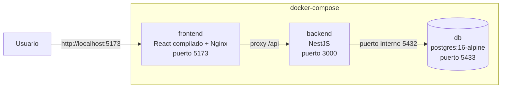
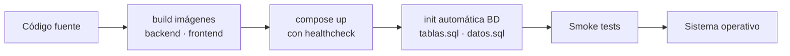

# V. IMPLEMENTACIÓN Y RESULTADOS

## 5.1. Guía de despliegue

Todo el sistema se despliega con **Docker Compose** en tres servicios que se levantan con un solo comando. La contenerización garantiza que lo que funciona en la máquina del desarrollador funcione idéntico en cualquier otro entorno, sin instalar Node.js ni PostgreSQL localmente.

### Arquitectura del despliegue



| Servicio | Imagen / build | Puerto host | Descripción |
|---|---|---|---|
| `db` | postgres:16-alpine | 5433 | Base `optica_db`; volumen persistente `pgdata`; healthcheck cada 5 s |
| `backend` | build desde `./backend` | 3000 | API REST; arranca solo cuando la base pasó el healthcheck |
| `frontend` | build desde `./frontend` | 5173 | Aplicación React servida por Nginx |

### Inicialización automática de la base de datos

Los scripts SQL están montados como archivos de inicialización dentro del contenedor; PostgreSQL los ejecuta **solo la primera vez**, cuando el directorio de datos está vacío, en orden alfabético:

1. `/docker-entrypoint-initdb.d/01_tablas.sql` — esquema completo (10 tablas, restricciones y relaciones).
2. `/docker-entrypoint-initdb.d/02_datos.sql` — datos de prueba (usuarios, clientes, productos, ventas de ejemplo).

El healthcheck (`pg_isready`) evita una carrera típica: el backend no intenta conectarse hasta que la base acepta conexiones reales.

### Variables de entorno

| Variable | Valor en despliegue | Uso |
|---|---|---|
| DB_HOST / DB_PORT | db / 5432 | Conexión interna al servicio de base |
| DB_USERNAME / DB_PASSWORD | postgres / 1234 | Credenciales de PostgreSQL |
| DB_DATABASE | optica_db | Nombre de la base |
| JWT_SECRET | clave definida en compose | Firma de tokens |
| JWT_EXPIRES_IN | 24h | Vigencia de sesión |
| PORT | 3000 | Puerto del API |

### Comandos de operación

```bash
docker compose up -d          # levantar todo (primera vez crea BD y siembra datos)
docker compose ps             # estado de los contenedores
docker compose down           # detener conservando datos
docker compose down -v        # reiniciar BD desde cero (borra volumen y vuelve a sembrar)
docker compose build          # reconstruir tras cambios de código
```

| URL | Servicio |
|---|---|
| http://localhost:5173 | Aplicación web |
| http://localhost:3000/api/docs | Documentación Swagger del API |
| localhost:5433 | PostgreSQL (usuario `postgres`) |

### Modo desarrollo (sin Docker)

Para iterar código conviene el modo manual: crear `optica_db` y ejecutar los dos scripts SQL con `psql`; luego `npm install && npm run start:dev` en `backend/` (recarga en caliente en el puerto 3000) y `npm install && npm run dev` en `frontend/` (Vite en el puerto 5173, con proxy `/api` hacia el backend incluido). El `.env.example` documenta las variables necesarias del backend.

## 5.2. Pruebas de software

Las pruebas cubrieron tres niveles complementarios: unitarias sobre la lógica de negocio, funcionales sobre cada módulo desplegado y smoke tests tras cada despliegue.

### Pruebas unitarias (Jest)

Se implementaron pruebas unitarias para los servicios críticos del backend, sustituyendo los repositorios TypeORM por dobles de prueba mediante inyección de dependencias (patrón que la arquitectura de capas habilita de forma natural). Los casos priorizaron las reglas donde un error cuesta dinero: validación de stock, cálculo de saldos, emisión de recibos y autenticación.

La ejecución final arrojó **16 pruebas aprobadas en 3 suites, sin fallos**:

```
Test Suites: 3 passed, 3 total
Tests:       16 passed, 16 total
Snapshots:   0 total
Time:        15.095 s
```

| Suite | Casos | Qué verifica |
|---|---|---|
| `ventas.service.spec.ts` | 6 | Venta exitosa descuenta stock y emite `REC-0001` · saldo con anticipo (pago parcial) · rechazo por stock insuficiente con rollback · producto inexistente · monto pagado mayor al total · `NotFoundException` para venta inexistente |
| `clientes.service.spec.ts` | 6 | Alta con CI inédito · rechazo de CI duplicada (`ConflictException`) · `NotFoundException` · actualización de CI que colisiona con otro cliente · bloqueo de eliminación con ventas asociadas · eliminación limpia sin registros |
| `auth.service.spec.ts` | 4 | Credenciales correctas devuelven el usuario **sin** el hash · contraseña errónea → null · usuario inexistente → null · token firmado con `sub`, `usuario` y `rol` + perfil completo |

Dos detalles valiosos que estas pruebas dejaron en evidencia sobre el código de producción: el rollback de la transacción se dispara correctamente ante cualquier falla intermedia (nada queda registrado a medias), y la respuesta de autenticación nunca expone el hash de la contraseña.

### Pruebas de integración

Verificación de la comunicación completa frontend → API → base de datos sobre el sistema desplegado con Docker, recorriendo flujos completos por HTTP con token real.

### Casos de prueba funcionales por módulo

**Autenticación y usuarios**

| ID | Caso | Entrada | Resultado esperado | Verificado |
|---|---|---|---|---|
| AUT-01 | Login correcto admin | admin / admin123 | Token JWT + redirección a Dashboard | ✅ |
| AUT-02 | Login contraseña errónea | admin / incorrecta | Mensaje "Credenciales inválidas", sin token | ✅ |
| AUT-03 | Acceso a ruta admin como vendedor | mlopez intenta /admin/reportes | Vista bloqueada por RequireAdmin y 403 del API | ✅ |
| USR-01 | Crear usuario con rol | Datos válidos + rol Vendedor | Aparece en listado; puede iniciar sesión | ✅ |
| USR-02 | CI duplicado | CI ya registrado | Rechazo con mensaje claro (backend y UI) | ✅ |

**Clientes y recetas**

| ID | Caso | Entrada | Resultado esperado | Verificado |
|---|---|---|---|---|
| CLI-01 | Registrar cliente | CI numérico, nombre válido | Cliente creado y visible con búsqueda | ✅ |
| CLI-02 | Nombre con números | nombre "Carlos123" | Validación rechaza en formulario (Zod) y en API | ✅ |
| REC-01 | Registrar receta OD/OS | Esfera −1.50, cilindro, eje, DP | Guarda ambos ojos; aparece en historial del cliente | ✅ |
| REC-02 | Receta PDF | Botón imprimir | PDF descargable con valores por ojo | ✅ |

**Inventario y ventas**

| ID | Caso | Entrada | Resultado esperado | Verificado |
|---|---|---|---|---|
| INV-01 | Registrar producto | Código único, precios, stock mínimo | Visible en inventario con categoría | ✅ |
| INV-02 | Alerta stock bajo | stock < stock_minimo | Producto resaltado en Inventario y Dashboard | ✅ |
| VEN-01 | Venta normal | 2 productos, pago total | Stock descontado, recibo REC-XXXX generado | ✅ |
| VEN-02 | Stock insuficiente | cantidad > stock disponible | Rechazo: "Stock insuficiente para [producto]" | ✅ |
| VEN-03 | Pago parcial | montoPagado < total | Venta con saldo pendiente en recibo | ✅ |
| VEN-04 | Monto inválido | montoPagado > total | Rechazo: no puede exceder el total | ✅ |
| VEN-05 | Recibo PDF | Confirmar venta | PDF con detalle, método de pago y saldo | ✅ |

**Órdenes de trabajo y reportes**

| ID | Caso | Entrada | Resultado esperado | Verificado |
|---|---|---|---|---|
| ORD-01 | Crear orden | Cliente + receta + venta | Estado inicial PENDIENTE | ✅ |
| ORD-02 | Cambiar estado | PENDIENTE → EN PROCESO → LISTO PARA ENTREGA → ENTREGADO | Transición persistida; filtro por estado funciona | ✅ |
| ORD-03 | Orden PDF | Imprimir orden | PDF con cliente, receta asociada y observaciones | ✅ |
| REP-01 | Ventas por mes | Período con ventas registradas | Gráfico/tabla coherente con los datos sembrados | ✅ |
| REP-02 | Reportes exportables | Exportar PDF | Documento descargable con cifras del período | ✅ |
| REP-03 | Vendedor solicita reporte | token rol Vendedor | 403 Forbidden desde el API | ✅ |

### Smoke tests post-despliegue

Checklist ejecutado tras cada despliegue nuevo del stack:

1. Los tres contenedores figuran `Up` y la base pasa el healthcheck.
2. `POST /api/auth/login` responde 200 con token.
3. Swagger accesible en `/api/docs`.
4. Login web carga Dashboard (admin) y Ventas (vendedor).
5. Alta rápida de cliente + venta de prueba genera recibo.

### Pruebas de seguridad y rendimiento

- **Autorización cruzada:** peticiones con token de Vendedor contra rutas de Administrador devuelven 403 en todos los casos probados.
- **Tokens alterados/expirados:** el API responde 401 y el interceptor devuelve al login limpiamente.
- **Payloads maliciosos:** propiedades extra en el JSON son eliminadas o rechazadas (`forbidNonWhitelisted`); inyecciones de texto en campos de nombre son bloqueadas por regex en tres niveles.
- **Carga básica:** operaciones CRUD simultáneas en sesión local respondieron sin degradación apreciable para el volumen de una óptica (decenas de usuarios concurrentes es un escenario holgado para este stack).

## 5.3. Evaluación de resultados

La evaluación contrasta los cuatro objetivos específicos con evidencia verificable del prototipo.

| Objetivo específico | Evidencia en el prototipo | Cumplimiento |
|---|---|---|
| **OE1** Determinar procesos actuales y necesidades | Diagnóstico documentado en capítulos I y III: gestión manual en papel/Excel, problemas de inventario, seguimiento de pedidos y ventas identificados; 7 épicas priorizadas con historias de usuario | ✅ |
| **OE2** Diseñar base de datos eficiente y organizada | `optica_db` con 10 tablas normalizadas, restricciones CHECK, relaciones íntegras y diccionario documentado (sección 4.1); desplegada y sembrada automáticamente vía Docker | ✅ |
| **OE3** Desarrollar los módulos requeridos | 9 módulos operativos: autenticación JWT/RBAC, usuarios, clientes, inventario, recetas OD/OS, ventas con recibos PDF, órdenes con flujo de estados, dashboard y reportes (capítulo IV) | ✅ |
| **OE4** Probar exhaustivamente el sistema | Suite unitaria con 16 pruebas aprobadas en verde (3 suites), 22 casos funcionales verificados, smoke tests post-despliegue y pruebas de autorización cruzada (sección 5.2) | ✅ |

### Verificación de las épicas del MVP

Las siete épicas definidas en el alcance quedaron implementadas y funcionando sobre el despliegue final:

- ✅ Gestión de Usuarios y Seguridad (login, roles, cierre de sesión seguro)
- ✅ Gestión de Clientes (registro, búsqueda por CI/nombre/teléfono, historial)
- ✅ Gestión de Productos (CRUD, alertas de stock mínimo en Dashboard)
- ✅ Gestión de Recetas Optométricas (OD/OS completo, historial, PDF)
- ✅ Gestión de Ventas (carrito, descuento automático de stock, pago total o a cuenta, recibo PDF)
- ✅ Gestión de Órdenes de Trabajo (estados, filtros, PDF con receta y venta)
- ✅ Generación de Reportes (dashboard, ventas por mes, por vendedor, top productos, exportables)

Ninguna funcionalidad marcada como *Future Work* fue incorporada al MVP, respetando el alcance definido.

### Impacto observable frente al proceso manual

Con el sistema operativo, los cambios frente al proceso en papel son directos:

- El registro de un cliente pasó de llenar una ficha física a un formulario con validación instantánea; el dato queda disponible para búsqueda inmediata por cualquier criterio.
- El stock ya no depende del conteo manual: se actualiza en el momento exacto de cada venta y avisa solo cuando algo está por agotarse.
- El comprobante y la orden de trabajo se generan solos, eliminando la transcripción manual — fuente histórica de errores entre lo vendido y lo fabricado.
- La información comercial (ventas del día, desempeño por vendedor, rotación de productos) existe sin esfuerzo adicional; antes simplemente no existía.
- El pago a cuenta quedó formalizado: el recibo muestra monto pagado y saldo, terminando con el cuaderno de deudas informales.

Como validación cualitativa, el personal puede atender un ciclo completo —cliente nuevo, receta, venta, orden de trabajo— sin salir del navegador, y la administración consulta el estado del negocio sin preguntar a nadie.

## 5.4. Pipeline de despliegue

Aunque el MVP no incluye integración continua alojada, el flujo de entrega está automatizado hasta donde importa: el repositorio contiene todo lo necesario para reproducir el despliegue con `docker compose up -d`. La canalización conceptual es:



Cada paso es repetible y libre de pasos manuales propensos a error: construir imágenes, orquestar servicios, inicializar la base con scripts versionados y verificar con la lista de humo de la sección 5.2. Migrar este pipeline a GitHub Actions (build + smoke automáticos ante cada push) requiere únicamente trasladar esos mismos comandos, sin cambios en el proyecto.
